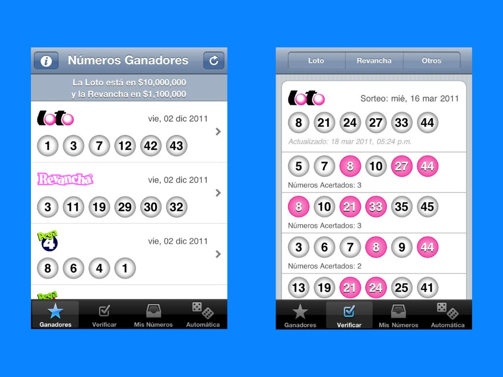

# LotteryPR - Puerto Rico Lottery App

A native iOS application for tracking Puerto Rico lottery games, built as a first iOS development project. The app provides real-time lottery results, number management, and verification features for multiple Puerto Rican lottery games.

## Features

- **Real-time Results**: Fetches current winning numbers for all major PR lottery games
- **Multiple Games**: Supports Loto, Revancha, Pega Dos, Pega Tres, and Pega Cuatro
- **Number Management**: Save and organize your favorite lottery numbers
- **Quick Pick**: Generate random numbers for any game
- **Number Verification**: Check your numbers against winning results
- **Offline Support**: View saved numbers and previous results without internet

## Supported Games

- **Loto**: 6 numbers (1-46) - Main lottery game
- **Revancha**: Second chance drawing 
- **Pega Dos**: 2 numbers (0-9)
- **Pega Tres**: 3 numbers (0-9)
- **Pega Cuatro**: 4 numbers (0-9)

## Technical Details

**Platform**: iOS 4.0+  
**Language**: Objective-C (pre-ARC)  
**Architecture**: Model-View-Controller with delegate patterns  
**Data Source**: XML RSS feeds from official lottery sources  
**Storage**: NSCoding-based local persistence  

### Key Technical Features

- **Custom UI Components**: Hand-drawn lottery ball views with color-coded visualization
- **XML Parsing**: NSXMLParser implementation for real-time data feeds
- **Memory Management**: Manual retain/release patterns throughout (pre-ARC era)
- **Network Handling**: Custom network layer with offline fallback support
- **Tab-based Navigation**: UITabBarController with multiple specialized views
- **In-App Purchases**: StoreKit integration for premium features

### Architecture Highlights

- **Data Models**: Inheritance-based lottery classes with NSCoding persistence
- **Networking**: Asynchronous XML parsing with delegate callbacks
- **UI Framework**: XIB-based interface files with programmatic customization
- **Storage**: File-based persistence using NSCoding protocol

## Project Status

**Archived** - This project represents early iOS development work and is preserved for historical reference. Built during the iOS 4/5 era using pre-ARC Objective-C patterns and manual memory management.

---

*This was my first iOS application, developed to learn native iOS development fundamentals and explore the iOS SDK ecosystem.*